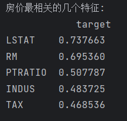

# **波士顿房价相关性分析和预测**

## 一，实验背景

### 作业简介

数据集记载了13种可能影响房价的因素和该类型房屋的均价，我们期望能通过这个数据集来了解那些因素影响房屋均价最多以及能通过这13个因素预测房屋的均价

## 二，代码分析

### 1.可视化分析

各种特征的直方图

数据集中一些特征的箱型图

### 2.热力图相关性分析

数据集的热力图

可见其中有相当一部分特征值的相关性的绝对值较高  
比如 辐射性公路的接近指数和全职财产税率（接近辐射性公路指数越高，税率越高）  
    一氧化氮浓度和到波士顿五个中心的距离（离中心距离越短，一氧化氮浓度越高）  
    1940年前建成的房屋比例和到波士顿五个中心的距离 （离中心距离越短，1940年前建成的房屋比列越低）  
这些都是符合人的直觉的

输出最影响房价的五个因素

### 3.神经网络预测房屋价格

对13个特征值进行神经网络设计，通过优化算法（梯度下降法）迭代逼近损失函数的最小值，负梯度是函数下降最快的方向，分批次读入数据以加快计算的速度

#### （1）.用梯度下降法逼近损失函数的最小值
可以看到随着迭代次数的增加，损失函数的值在逐渐的减小

#### （2）.最终采用参数 epoch_num=200,batch_size=30,eta=0.1的参数进行训练 得到结果

#### （3）生成样本误差图

## 总结与展望

上述分析可以看到，对于房价影响最大的是 人口中地位低下者的比列，其次是住宅平均房间数

在预测上，预测大体上相同，但是有一定的滞后性，同时对于峰值的拟合性是并不是很好，整体的房价预测值要大一些，并不准确，还可以考虑其他方法选择更好的参数